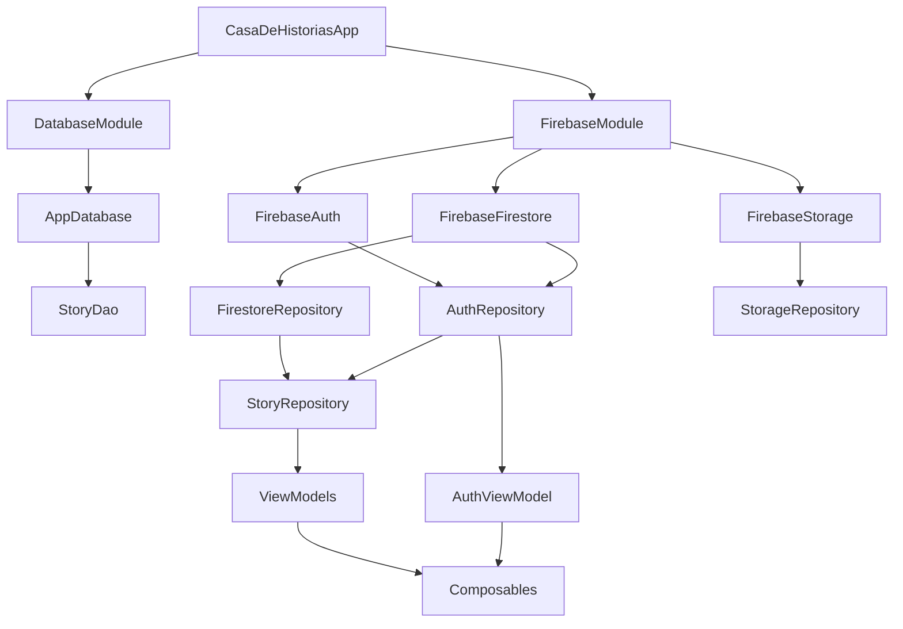

Casa de Historias uses Hilt (built on Dagger) for dependency injection, providing compile-time safety and automatic dependency management.

## Why Hilt?

<CardGroup cols={2}>
  <Card title="Compile-Time Safety" icon="shield-check">
    Dependency errors are caught at compile time, not runtime
  </Card>
  <Card title="Automatic Lifecycle" icon="recycle">
    Dependencies are scoped to Android components automatically
  </Card>
  <Card title="Less Boilerplate" icon="code">
    Minimal setup compared to manual dependency injection
  </Card>
  <Card title="Testing Support" icon="flask">
    Easy to replace dependencies with test implementations
  </Card>
</CardGroup>

## Setup

### Application Class

Annotate your Application class with `@HiltAndroidApp`:

```kotlin CasaDeHistoriasApp.kt
@HiltAndroidApp
class CasaDeHistoriasApp : Application()
```

This triggers Hilt's code generation and sets up the dependency graph.

### Activity Setup

Annotate activities with `@AndroidEntryPoint`:

```kotlin MainActivity.kt
@AndroidEntryPoint
class MainActivity : ComponentActivity() {
    override fun onCreate(savedInstanceState: Bundle?) {
        super.onCreate(savedInstanceState)
        setContent {
            CasaDeHistoriasTheme {
                MainContainer()
            }
        }
    }
}
```

## Hilt Modules

### DatabaseModule

Provides Room database and DAOs:

```kotlin DatabaseModule.kt
@Module
@InstallIn(SingletonComponent::class)
object DatabaseModule {

    @Provides
    @Singleton
    fun provideDatabase(@ApplicationContext context: Context): AppDatabase {
        return Room.databaseBuilder(
            context,
            AppDatabase::class.java,
            "casa_historias_db"
        ).build()
    }

    @Provides
    fun provideStoryDao(database: AppDatabase): StoryDao {
        return database.storyDao()
    }
}
```

**Key Points:**

- `@Module`: Marks a class as a Hilt module
- `@InstallIn(SingletonComponent::class)`: Specifies the component lifecycle
- `@Provides`: Marks methods that provide dependencies
- `@Singleton`: Ensures only one instance exists
- `@ApplicationContext`: Injects the application context

### FirebaseModule

Provides Firebase service instances:

```kotlin FirebaseModule.kt
@Module
@InstallIn(SingletonComponent::class)
object FirebaseModule {

    @Provides
    @Singleton
    fun provideFirebaseAuth(): FirebaseAuth = FirebaseAuth.getInstance()

    @Provides
    @Singleton
    fun provideFirebaseFirestore(): FirebaseFirestore = FirebaseFirestore.getInstance()

    @Provides
    @Singleton
    fun provideFirebaseStorage(): FirebaseStorage = FirebaseStorage.getInstance()
}
```

<Info>
Firebase services are singletons, so we use `@Singleton` scope to ensure only one instance exists throughout the app lifecycle.
</Info>

## Component Scopes

Hilt provides several component scopes:

| Component | Scope | Lifecycle |
|-----------|-------|----------|
| `SingletonComponent` | `@Singleton` | Application lifetime |
| `ActivityComponent` | `@ActivityScoped` | Activity lifetime |
| `ViewModelComponent` | `@ViewModelScoped` | ViewModel lifetime |
| `ActivityRetainedComponent` | `@ActivityRetainedScoped` | Survives configuration changes |

### SingletonComponent

Used for dependencies that should live for the entire app lifecycle:

```kotlin
@Module
@InstallIn(SingletonComponent::class)
object AppModule {
    @Provides
    @Singleton
    fun provideApiService(): ApiService { ... }
}
```

### ViewModelComponent

Used for dependencies scoped to a ViewModel:

```kotlin
@Module
@InstallIn(ViewModelComponent::class)
object ViewModelModule {
    @Provides
    fun provideUseCaseFactory(): UseCaseFactory { ... }
}
```

## Injecting Dependencies

### Constructor Injection

The preferred method for classes you own:

```kotlin
@Singleton
class StoryRepository @Inject constructor(
    private val firestoreRepository: FirestoreRepository,
    private val authRepository: AuthRepository
) {
    // Repository implementation
}
```

### ViewModel Injection

Use `@HiltViewModel` for ViewModels:

```kotlin
@HiltViewModel
class StoryViewModel @Inject constructor(
    private val repository: StoryRepository
) : ViewModel() {
    // ViewModel implementation
}
```

In Composables, use `hiltViewModel()`:

```kotlin
@Composable
fun StoryListScreen(
    viewModel: StoryViewModel = hiltViewModel()
) {
    // Screen content
}
```

### Field Injection

Use for Android framework classes:

```kotlin
@AndroidEntryPoint
class MyFragment : Fragment() {
    @Inject lateinit var repository: StoryRepository
    
    override fun onViewCreated(view: View, savedInstanceState: Bundle?) {
        super.onViewCreated(view, savedInstanceState)
        // repository is now available
    }
}
```

## Repository Pattern with Hilt

Repositories use constructor injection to receive their dependencies:

```kotlin AuthRepository.kt
@Singleton
class AuthRepository @Inject constructor(
    private val auth: FirebaseAuth,
    private val firestore: FirebaseFirestore
) {
    suspend fun signIn(email: String, password: String): Result<FirebaseUser?> {
        return try {
            val result = auth.signInWithEmailAndPassword(email, password).await()
            Result.success(result.user)
        } catch (e: Exception) {
            Result.failure(e)
        }
    }
}
```

```kotlin FirestoreRepository.kt
@Singleton
class FirestoreRepository @Inject constructor(
    private val firestore: FirebaseFirestore
) {
    fun getAllStoriesFlow(): Flow<List<StoryFirestore>> = callbackFlow {
        val listener = firestore.collection("stories")
            .addSnapshotListener { snapshot, error ->
                // Handle snapshot
            }
        awaitClose { listener.remove() }
    }
}
```

```kotlin StorageRepository.kt
@Singleton
class StorageRepository @Inject constructor(
    private val storage: FirebaseStorage
) {
    suspend fun uploadImage(uri: Uri, storyId: String): String? {
        return try {
            val ref = storage.reference.child("stories/$storyId/cover.jpg")
            ref.putFile(uri).await()
            ref.downloadUrl.await().toString()
        } catch (e: Exception) {
            null
        }
    }
}
```

## Dependency Graph

Here's how dependencies flow through the app:



## Testing with Hilt

### Test Module

Create test modules that replace production dependencies:

```kotlin
@Module
@InstallIn(SingletonComponent::class)
object TestDatabaseModule {
    @Provides
    @Singleton
    fun provideTestDatabase(@ApplicationContext context: Context): AppDatabase {
        return Room.inMemoryDatabaseBuilder(
            context,
            AppDatabase::class.java
        ).allowMainThreadQueries().build()
    }
}
```

### Uninstall Production Module

```kotlin
@UninstallModules(DatabaseModule::class)
@HiltAndroidTest
class MyTest {
    // Test implementation
}
```

### Mock Dependencies

```kotlin
@HiltAndroidTest
class StoryViewModelTest {
    @get:Rule
    var hiltRule = HiltAndroidRule(this)
    
    @Inject
    lateinit var repository: StoryRepository
    
    @Before
    fun init() {
        hiltRule.inject()
    }
    
    @Test
    fun testLoadStories() {
        // Test with injected dependencies
    }
}
```

## Custom Qualifiers

Use qualifiers when you need multiple instances of the same type:

```kotlin
@Qualifier
@Retention(AnnotationRetention.BINARY)
annotation class IoDispatcher

@Qualifier
@Retention(AnnotationRetention.BINARY)
annotation class MainDispatcher

@Module
@InstallIn(SingletonComponent::class)
object DispatcherModule {
    @Provides
    @IoDispatcher
    fun provideIoDispatcher(): CoroutineDispatcher = Dispatchers.IO
    
    @Provides
    @MainDispatcher
    fun provideMainDispatcher(): CoroutineDispatcher = Dispatchers.Main
}

// Usage
class MyRepository @Inject constructor(
    @IoDispatcher private val ioDispatcher: CoroutineDispatcher
) {
    // Use ioDispatcher
}
```

## Entry Points

Access Hilt dependencies from classes Hilt doesn't support:

```kotlin
@EntryPoint
@InstallIn(SingletonComponent::class)
interface MyEntryPoint {
    fun repository(): StoryRepository
}

class NonHiltClass(context: Context) {
    private val repository: StoryRepository
    
    init {
        val entryPoint = EntryPointAccessors.fromApplication(
            context,
            MyEntryPoint::class.java
        )
        repository = entryPoint.repository()
    }
}
```

## Best Practices

<AccordionGroup>
  <Accordion title="Prefer constructor injection">
    Use constructor injection whenever possible. It's more testable and explicit.
  </Accordion>
  
  <Accordion title="Use appropriate scopes">
    Match dependency scope to its lifecycle. Don't use `@Singleton` for everything.
  </Accordion>
  
  <Accordion title="Keep modules focused">
    Create separate modules for different concerns (database, network, etc.).
  </Accordion>
  
  <Accordion title="Avoid circular dependencies">
    Design your dependency graph to avoid circular references.
  </Accordion>
  
  <Accordion title="Use qualifiers sparingly">
    Only use qualifiers when you truly need multiple instances of the same type.
  </Accordion>
</AccordionGroup>

## Common Patterns

### Providing Interfaces

When you need to provide an interface implementation:

```kotlin
@Module
@InstallIn(SingletonComponent::class)
abstract class RepositoryModule {
    @Binds
    @Singleton
    abstract fun bindStoryRepository(
        impl: StoryRepositoryImpl
    ): StoryRepository
}
```

### Providing Multiple Implementations

```kotlin
@Qualifier
annotation class LocalDataSource

@Qualifier
annotation class RemoteDataSource

@Module
@InstallIn(SingletonComponent::class)
object DataSourceModule {
    @Provides
    @LocalDataSource
    fun provideLocalDataSource(dao: StoryDao): DataSource = LocalDataSource(dao)
    
    @Provides
    @RemoteDataSource
    fun provideRemoteDataSource(api: ApiService): DataSource = RemoteDataSource(api)
}
```

## Debugging

### Common Errors

**Missing binding:**
```
error: [Dagger/MissingBinding] StoryRepository cannot be provided
```
**Solution:** Add `@Inject constructor` or provide it in a module.

**Circular dependency:**
```
error: [Dagger/DependencyCycle] Found a dependency cycle
```
**Solution:** Refactor to remove the cycle or use `Provider<T>`.

### Viewing the Dependency Graph

Enable Hilt's graph visualization in build.gradle:

```gradle
hilt {
    enableAggregatingTask = true
}
```

## Related Documentation

<CardGroup cols={2}>
  <Card title="Data Layer" icon="database" href="/architecture/data-layer">
    See how repositories are provided
  </Card>
  <Card title="UI Layer" icon="paint-brush" href="/architecture/ui-layer">
    Learn about ViewModel injection
  </Card>
</CardGroup>